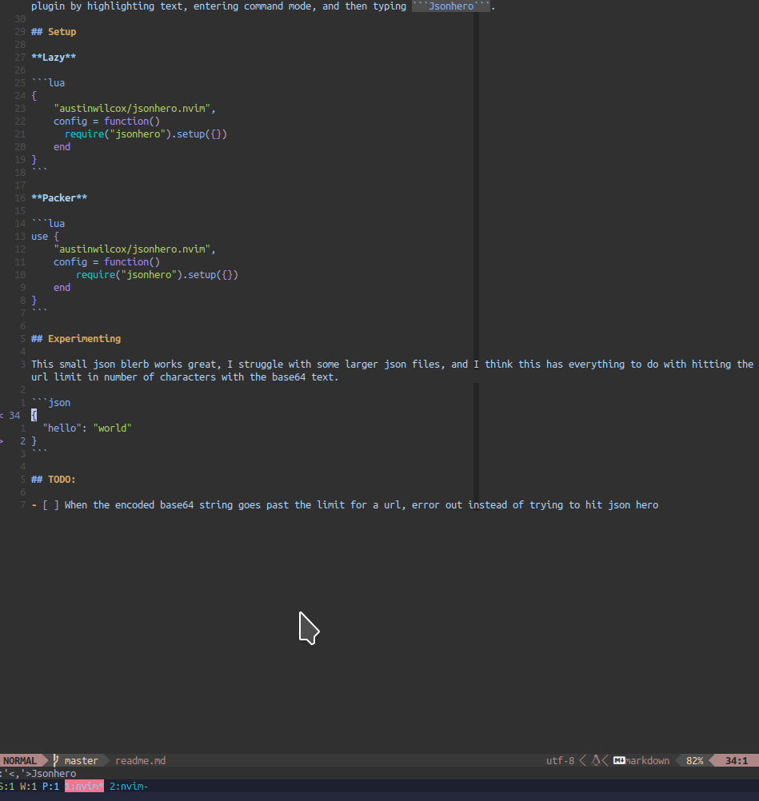

# JsonHero.nvim

This plugin is intended to open visually selected json text from neovim in a new browser window in Json Hero. You can trigger the plugin by highlighting text, entering command mode, and then typing ```Jsonhero```.



## Setup

**Lazy**

```lua
{
    "austinwilcox/jsonhero.nvim",
    config = function()
      require("jsonhero").setup({})
    end
}
```

**Packer**

```lua
use {
    "austinwilcox/jsonhero.nvim",
    config = function()
        require("jsonhero").setup({})
    end
}
```

## Experimenting

This small json blerb works great, I struggle with some larger json files, and I think this has everything to do with hitting the url limit in number of characters with the base64 text.

```json
{
  "hello": "world"
}
```

## TODO:

- [ ] When the encoded base64 string goes past the limit for a url, error out instead of trying to hit json hero
